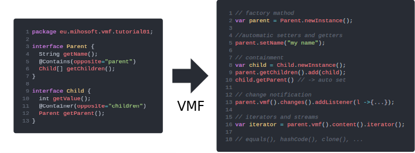

# VMF-Tutorials 
 

This collection of tutorials gives an introduction to [VMF](https://github.com/miho/VMF) and its use in regular Java projects.

## Contents

- [Introduction](https://github.com/miho/VMF-Tutorials/blob/master/README.md#introduction)
- [Defining your first model](https://github.com/miho/VMF-Tutorials/blob/master/VMF-Tutorial-01/README.md)
- [Using the Change Notification API](https://github.com/miho/VMF-Tutorials/blob/master/VMF-Tutorial-02/README.md)
- [Containment References](https://github.com/miho/VMF-Tutorials/tree/master/VMF-Tutorial-03/README.md)
- [Cross References](https://github.com/miho/VMF-Tutorials/tree/master/VMF-Tutorial-03b/README.md)
- [Undo/Redo API](https://github.com/miho/VMF-Tutorials/tree/master/VMF-Tutorial-04/README.md)
- [Using the Builder API](https://github.com/miho/VMF-Tutorials/tree/master/VMF-Tutorial-05/README.md)
- [Object Graph Traversal and Custom Property Order](https://github.com/miho/VMF-Tutorials/tree/master/VMF-Tutorial-06/README.md)
- [Immutable Objects & ReadOnly API](https://github.com/miho/VMF-Tutorials/tree/master/VMF-Tutorial-07/README.md)
- [Custom Behavior & Delegation](https://github.com/miho/VMF-Tutorials/tree/master/VMF-Tutorial-08/README.md)
- [Custom Default Values for Properties](https://github.com/miho/VMF-Tutorials/tree/master/VMF-Tutorial-09/README.md)
- [Equals & HashCode](https://github.com/miho/VMF-Tutorials/tree/master/VMF-Tutorial-10/README.md)
- [Annotations](https://github.com/miho/VMF-Tutorials/tree/master/VMF-Tutorial-11/README.md)
- [Cloning (Deep Copy & Shallow Copy)](https://github.com/miho/VMF-Tutorials/tree/master/VMF-Tutorial-12/README.md)
- [The Reflection API](https://github.com/miho/VMF-Tutorials/tree/master/VMF-Tutorial-13/README.md)
- [Custom Model Documentation](https://github.com/miho/VMF-Tutorials/tree/master/VMF-Tutorial-14/README.md)

## Introduction

[VMF](https://github.com/miho/VMF) is a lightweight modeling framework for the Java platform. It generates/supports:

- getters and setters
- default values
- containment
- cross refrences
- builder API
- equals() and hashCode()
- deep and shallow cloning
- change notification
- undo/redo
- object graph traversal API via iterators and streams
- immutable types and read-only wrappers
- delegation
- annotations
- reflection
- ...

A [VMF](https://github.com/miho/VMF) model consists of annotated Java interfaces. We could call this "wannabe" code. We just specify the interface and its properties and get a rich implementation that implements the property setters and getters, builders and much more. Even for a simple model [VMF](https://github.com/miho/VMF) generated a lot of useful API:

VMF integrates well into manual Java implementations. It comes with a Gradle plugin which means that using VMF is very simple. The tutorials will walk you through all major aspects of [VMF](https://github.com/miho/VMF).

Continue with the [FIRST TUTORIAL](https://github.com/miho/VMF-Tutorials/blob/master/VMF-Tutorial-01/README.md).

